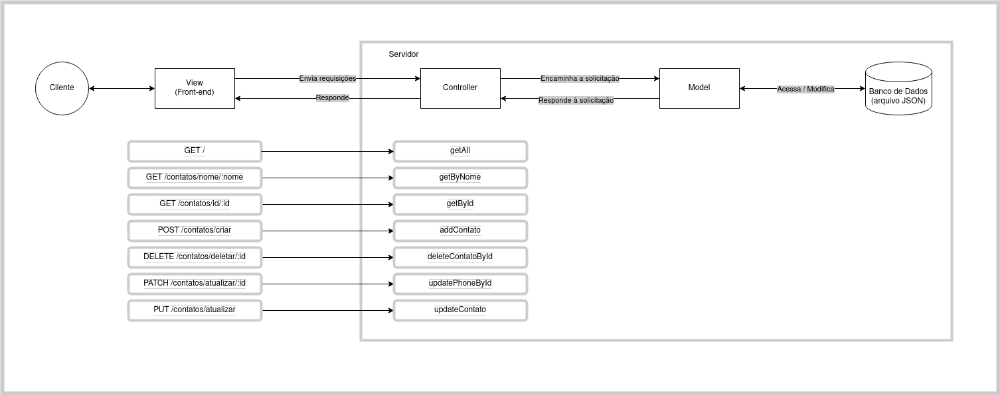

# Projeto guiado - CRUD com BD
# Semana 14

## Projeto agenda de contatos:
Criar uma API Agenda para reunir contatos do nosso usuário.

Representação visual da Arquitetura utilizada:

## Dados da Collection:
- id
- nome
- celular
- dataNascimento
- fotoPerfil

## Métodos HTTP utilizados:
- GET    - Busca os contatos
- POST   - Cria um novo contato
- PUT    - Atualiza o contato completo, menos o Id
- PATCH  - Atualiza apenas o telefone do contato
- DELETE - Deleta um contato

## A API possui as seguintes rotas:
- "/" - Retorna index com apresentação 
- "/contatos" - Retorna todos os contatos do banco de dados
- "/contatos/nome/:nome" - Retorna contato por nome específico
- "/contatos/id/:id" - Retorna contato por id específico
- "/contatos/criar" - Cria novo contato e retorna mensagem 
- "/contatos/deletar/:id" - Deleta contato por id específico e retorna mensagem 
- "/contatos/atualizar/telefone/:id" - Atualiza somente telefone do contato por id específico e retorna mensagem
- "/contatos/atualizar" - Atualiza completamente o contato e retorna mensagem (id não pode ser modificado)

## Estrutura do Projeto:
- Utiliza a arquitetura MVC (Movel View Controller).

## Instalar as dependências do projeto:
- npm init
- npm nodemon
- npm express
- npm cors
- npm mongoose